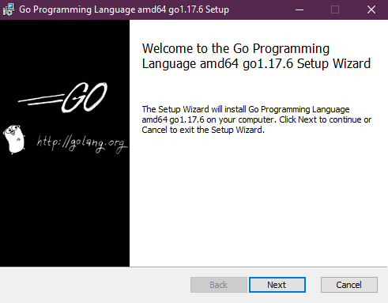
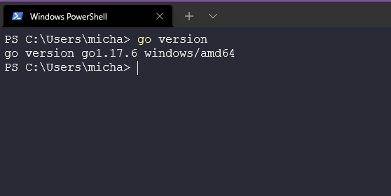
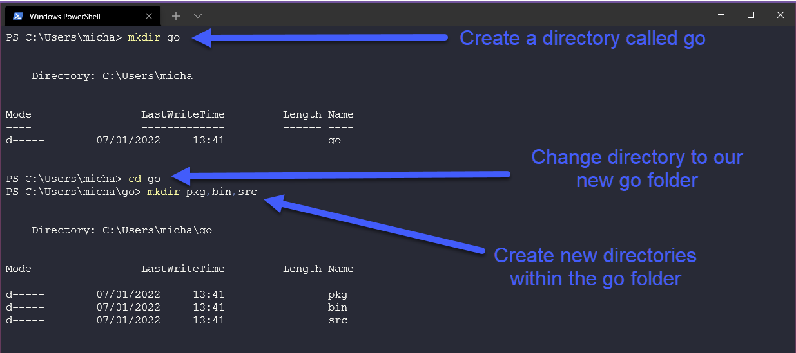
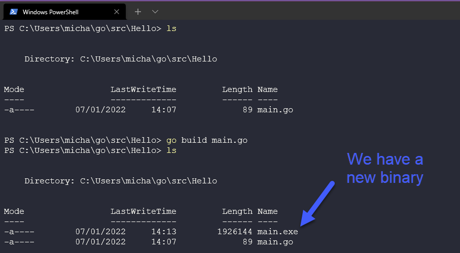

## Configuration de votre environnement DevOps pour Go et Hello World

Avant de nous plonger dans les fondamentaux de Go, nous devons installer Go sur notre poste de travail et faire ce que tout module "apprentissage de la programmation 101" nous enseigne : créer l'application Hello World. Comme cette étape va nous guider à travers les étapes d'installation de Go sur votre poste de travail, nous allons tenter de documenter le processus en images pour que les gens puissent facilement suivre.

Tout d'abord, rendez-vous sur [go.dev/dl](https://go.dev/dl/) et vous serez accueilli avec quelques options de téléchargement disponibles.


Si vous êtes arrivé jusqu'ici, vous savez probablement quel système d'exploitation de poste de travail vous utilisez, alors sélectionnez le téléchargement approprié et nous pouvons commencer l'installation. J'utilise Windows pour ce guide, donc à partir de cet écran, nous pouvons laisser tous les paramètres par défaut pour l'instant. **_(Je note qu'au moment de l'écriture, c'était la dernière version, donc les captures d'écran peuvent être obsolètes)_**



Notez également que si vous avez une version plus ancienne de Go installée, vous devrez la supprimer avant d'installer la nouvelle. Windows intègre cette fonctionnalité dans l'installateur et supprimera et installera en une seule opération.

Une fois terminé, ouvrez une invite de commande/terminal et vérifions que Go est installé. Si vous n'obtenez pas la sortie que nous voyons ci-dessous, Go n'est pas installé et vous devrez revenir sur vos pas.

`go version`



Ensuite, nous voulons vérifier notre environnement pour Go. Il est toujours bon de vérifier que vos répertoires de travail sont correctement configurés. Comme vous pouvez le voir ci-dessous, nous devons nous assurer que vous avez le répertoire suivant sur votre système.


Avez-vous vérifié ? Suivez-vous ? Vous obtiendrez probablement quelque chose comme ci-dessous si vous essayez de naviguer là-bas.


D'accord, créons ce répertoire. Pour plus de facilité, je vais utiliser la commande `mkdir` dans mon terminal PowerShell. Nous devons également créer 3 dossiers dans le dossier Go comme vous pouvez le voir ci-dessous.



Maintenant que nous avons Go installé et que notre répertoire de travail Go est prêt à l'emploi, nous avons besoin d'un environnement de développement intégré (IDE). Il en existe de nombreux disponibles, mais le plus courant et celui que j'utilise est Visual Studio Code ou Code. Vous pouvez en savoir plus sur les IDE [ici](https://www.youtube.com/watch?v=vUn5akOlFXQ).

Si vous n'avez pas encore téléchargé et installé VSCode sur votre poste de travail, vous pouvez le faire en vous rendant [ici](https://code.visualstudio.com/download). Comme vous pouvez le voir ci-dessous, vous avez différentes options de système d'exploitation.


Comme pour l'installation de Go, nous allons télécharger et installer en gardant les paramètres par défaut. Une fois terminé, vous pouvez ouvrir VSCode, sélectionner Ouvrir un fichier et naviguer vers notre répertoire Go que nous avons créé précédemment.


Vous pourriez recevoir un pop-up concernant la confiance. Lisez-le si vous le souhaitez, puis cliquez sur Oui, faites confiance aux auteurs. (Je ne suis pas responsable plus tard si vous commencez à ouvrir des choses en lesquelles vous n'avez pas confiance !)

Maintenant, vous devriez voir les trois dossiers que nous avons également créés précédemment. Ce que nous voulons faire maintenant, c'est faire un clic droit sur le dossier `src` et créer un nouveau dossier appelé `Hello`.


Plutôt facile jusqu'à présent, non ? Maintenant, nous allons créer notre premier programme Go sans comprendre ce que nous mettons dans cette prochaine phase.

Ensuite, créez un fichier appelé `main.go` dans votre dossier `Hello`. Dès que vous appuyez sur Entrée pour `main.go`, vous serez invité à installer l'extension Go ainsi que des packages. Vous pouvez également vérifier ce fichier `pkg` vide que nous avons créé il y a quelques étapes et remarquer que nous devrions avoir de nouveaux packages là-dedans maintenant.


Maintenant, lançons cette application Hello World. Copiez le code suivant dans votre nouveau fichier `main.go` et enregistrez-le.

```go
package main

import "fmt"

func main() {
    fmt.Println("Hello #90DaysOfDevOps")
}
```

Je comprends que ce qui précède puisse ne pas avoir de sens, mais nous aborderons davantage les fonctions, les packages et plus dans les prochains jours. Pour l'instant, exécutons notre application. De retour dans le terminal et dans notre dossier `Hello`, nous pouvons maintenant vérifier que tout fonctionne. En utilisant la commande ci-dessous, nous pouvons vérifier si notre programme d'apprentissage générique fonctionne.

```bash
go run main.go
```


Mais ce n'est pas tout. Que se passe-t-il si nous voulons maintenant prendre notre programme et l'exécuter sur d'autres machines Windows ? Nous pouvons le faire en construisant notre binaire à l'aide de la commande suivante :

```bash
go build main.go
```



Si nous exécutons cela, nous verrons la même sortie :

```bash
$ ./main.exe
Hello #90DaysOfDevOps
```

## Ressources

- [Enquête StackOverflow 2021 sur les développeurs](https://insights.stackoverflow.com/survey/2021)
- [Pourquoi nous choisissons Golang pour apprendre](https://www.youtube.com/watch?v=7pLqIIAqZD4&t=9s)
- [Jake Wright - Apprenez Go en 12 minutes](https://www.youtube.com/watch?v=C8LgvuEBraI&t=312s)
- [Techworld With Nana - Cours complet sur Golang - 3 heures 24 minutes](https://www.youtube.com/watch?v=yyUHQIec83I)
- [Techworld With Nana - Learn Go by Building a TodoList App](https://www.youtube.com/watch?v=XCZWyN9ZbEQ)
- [**PAS GRATUIT** Nigel Poulton Pluralsight - Fondamentaux de Go - 3 heures 26 minutes](https://www.pluralsight.com/courses/go-fundamentals)
- [FreeCodeCamp - Apprenez la programmation Go - Tutoriel Golang pour débutants](https://www.youtube.com/watch?v=YS4e4q9oBaU&t=1025s)
- [Hitesh Choudhary - Liste de lecture complète](https://www.youtube.com/playlist?list=PLRAV69dS1uWSR89FRQGZ6q9BR2b44Tr9N)

À bientôt sur [Jour 9](day09.md).

