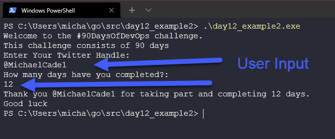
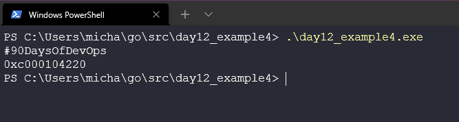

## Obtenir une entrée utilisateur avec des Pointeurs et un programme terminé

Hier ([Jour 11](day11.md)), nous avons créé notre premier programme Go qui était autonome, et les parties pour lesquelles nous voulions obtenir une entrée utilisateur étaient créées en tant que variables dans notre code et se voyaient attribuer des valeurs. Nous voulons maintenant demander à l'utilisateur son entrée pour donner à la variable la valeur pour le message final.

## Obtenir une entrée utilisateur

Avant de faire cela, jetons un coup d'œil à notre application et passons en revue les variables que nous voulons tester avant d'obtenir cette entrée utilisateur.

Hier, nous avons terminé avec notre code ressemblant à ceci [day11_example4.go](Go/day11_example4.go). Nous avons défini manuellement dans le code nos variables et constantes `challenge, daystotal, dayscomplete`.

Ajoutons maintenant une nouvelle variable appelée `TwitterName`. Vous pouvez trouver ce nouveau code à [day12_example1.go](Go/day12_example1.go), et si nous exécutons ce code, voici notre sortie.


Nous sommes au jour 12 et nous devrions changer ce `dayscomplete` chaque jour et compiler notre code chaque jour si cela était codé en dur, ce qui ne semble pas si génial.

Pour obtenir une entrée utilisateur, nous voulons obtenir la valeur d'un nom et du nombre de jours complétés. Pour ce faire, nous pouvons utiliser une autre fonction du package `fmt`.

Rappel sur le package `fmt` : différentes fonctions pour l'entrée et la sortie formatées (I/O)

- Imprimer des messages
- Collecter l'entrée utilisateur
- Écrire dans un fichier

Cela remplace l'attribution de la valeur d'une variable ; nous voulons demander à l'utilisateur son entrée.

```go
fmt.Scan(&TwitterName)
```

Remarquez que nous utilisons également `&` avant la variable. C'est ce qu'on appelle un pointeur, que nous aborderons dans la section suivante.

Dans notre code [day12_example2.go](Go/day12_example2.go), vous pouvez voir que nous demandons à l'utilisateur d'entrer deux variables, `TwitterName` et `DaysCompleted`.

Exécutons maintenant notre programme, et vous verrez que nous avons une entrée pour les deux éléments ci-dessus.



D'accord, c'est génial, nous avons obtenu une entrée utilisateur et nous avons imprimé un message, mais qu'en est-il de faire en sorte que notre programme nous dise combien de jours il nous reste dans notre défi ?

Pour ce faire, nous avons créé une variable appelée `remainingDays` et nous lui avons attribué la valeur `90` dans notre code. Ensuite, nous devons changer la valeur de cette valeur pour imprimer les jours restants lorsque nous obtenons l'entrée utilisateur de `DaysCompleted`. Nous pouvons le faire avec ce simple changement de variable.

```go
remainingDays = remainingDays - DaysCompleted
```

Vous pouvez voir à quoi ressemble notre programme terminé ici [day12_example3.go](Go/day12_example3.go).

Si nous exécutons maintenant ce programme, vous pouvez voir que ce simple calcul est effectué en fonction de l'entrée utilisateur et de la valeur de `remainingDays`.


## Qu'est-ce qu'un pointeur ? (Variables spéciales)

Un pointeur est une variable (spéciale) qui pointe vers l'adresse mémoire d'une autre variable.

Une excellente explication de ceci peut être trouvée ici sur [geeksforgeeks](https://www.geeksforgeeks.org/pointers-in-golang/).

Simplifions maintenant notre code et montrons avec et sans le `&` devant l'une de nos commandes d'impression. Cela nous donne l'adresse mémoire du pointeur. J'ai ajouté cet exemple de code ici [day12_example4.go](Go/day12_example4.go).

Voici l'exécution de ce code.



## Ressources

- [Enquête StackOverflow 2021 sur les développeurs](https://insights.stackoverflow.com/survey/2021)
- [Pourquoi nous choisissons Golang pour apprendre](https://www.youtube.com/watch?v=7pLqIIAqZD4&t)
- [Jake Wright - Apprenez Go en 12 minutes](https://www.youtube.com/watch?v=C8LgvuEBraI&t)
- [Techworld With Nana - Cours complet sur Golang - 3 heures 24 minutes](https://www.youtube.com/watch?v=yyUHQIec83I)
- [Techworld With Nana - Apprenez Go en construisant une application TodoList](https://www.youtube.com/watch?v=XCZWyN9ZbEQ)
- [**PAS GRATUIT** Nigel Poulton Pluralsight - Fondamentaux de Go - 3 heures 26 minutes](https://www.pluralsight.com/courses/go-fundamentals)
- [FreeCodeCamp - Apprenez la programmation Go - Tutoriel Golang pour débutants](https://www.youtube.com/watch?v=YS4e4q9oBaU&t)
- [Hitesh Choudhary - Liste de lecture complète](https://www.youtube.com/playlist?list=PLRAV69dS1uWSR89FRQGZ6q9BR2b44Tr9N)

À bientôt sur [Jour 13](day13.md).