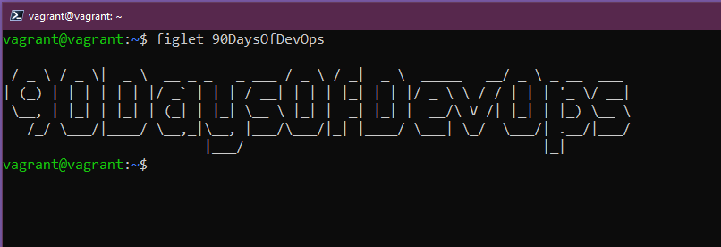
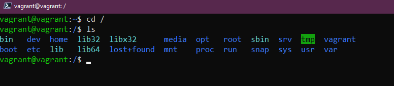
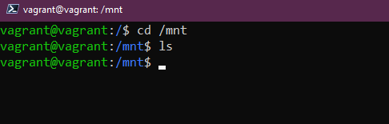
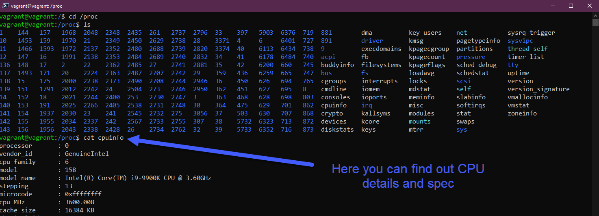

## Gestion de votre système Linux, du système de fichiers et du stockage

Jusqu'à présent, nous avons eu un aperçu bref de Linux et DevOps, puis nous avons configuré notre environnement de laboratoire en utilisant Vagrant [(Jour 14)](day14.md), ensuite nous avons abordé une petite partie des commandes qui feront partie de votre boîte à outils quotidienne dans le terminal pour accomplir des tâches [(Jour 15)](day15.md).

Ici, nous allons examiner trois domaines clés pour prendre soin de vos systèmes Linux avec les mises à jour, l'installation de logiciels, la compréhension des dossiers système utilisés et nous allons également examiner le stockage.

## Gestion d'Ubuntu et des logiciels

La première chose que nous allons examiner est la manière dont nous mettons à jour notre système d'exploitation. La plupart d'entre vous seront familiers avec ce processus sous Windows et macOS, cela semble légèrement différent sur un bureau et un serveur Linux.

Nous allons examiner le gestionnaire de paquets apt, c'est ce que nous allons utiliser sur notre VM Ubuntu pour les mises à jour et l'installation de logiciels.

Généralement, au moins sur les postes de travail de développement, j'exécute cette commande pour m'assurer que j'ai les dernières mises à jour disponibles à partir des dépôts centraux, avant toute installation de logiciel.

`sudo apt-get update`

Maintenant, nous avons une VM Ubuntu mise à jour avec les dernières mises à jour du système d'exploitation installées. Nous voulons maintenant installer quelques logiciels ici.

Choisissons `figlet` qui est un programme générant des bannières de texte.

Si nous tapons `figlet` dans notre terminal, vous verrez que nous ne l'avons pas installé sur notre système.

Vous verrez cependant ci-dessus qu'il nous donne quelques options d'installation `apt` que nous pourrions essayer. C'est parce que dans les dépôts par défaut, il y a un programme appelé figlet. Essayons `sudo apt install figlet`.

Nous pouvons maintenant utiliser notre application `figlet` comme vous pouvez le voir ci-dessous.

Si nous voulons supprimer cela ou l'une de nos installations de logiciels, nous pouvons également le faire via le gestionnaire de paquets `apt`.

`sudo apt remove figlet`

Il existe des dépôts tiers que nous pouvons également ajouter à notre système, ceux auxquels nous avons accès dès le départ sont les dépôts par défaut d'Ubuntu.

Par exemple, si nous voulions installer Vagrant sur notre VM Ubuntu, nous ne pourrions pas le faire pour le moment et vous pouvez le voir ci-dessous sur la première commande émise. Nous ajoutons ensuite la clé pour faire confiance au dépôt HashiCorp, puis nous ajoutons le dépôt à notre système.

Une fois le dépôt HashiCorp ajouté, nous pouvons continuer et exécuter `sudo apt install vagrant` et obtenir Vagrant installé sur notre système.

Il existe de nombreuses options en matière d'installation de logiciels, différentes options pour les gestionnaires de paquets, intégrés à Ubuntu, nous pourrions également utiliser des snaps pour nos installations de logiciels.

Espérons que cela vous donne une idée de la manière de gérer votre système d'exploitation et les installations de logiciels sous Linux.

## Système de fichiers expliqué

Linux est composé de fichiers de configuration, si vous voulez changer quelque chose, vous changez ces fichiers de configuration.

Sous Windows, vous avez le lecteur C: et c'est ce que nous considérons comme la racine. Sous Linux, nous avons `/`, c'est ici que nous allons trouver les dossiers importants de notre système Linux.

- `/bin` - Abréviation de binary, le dossier bin est l'endroit où se trouvent nos binaires dont votre système a besoin, les exécutables et les outils seront principalement trouvés ici.

- `/boot` - Tous les fichiers dont votre système a besoin pour démarrer. Comment démarrer et quel lecteur démarrer.

- `/dev` - Vous pouvez trouver des informations sur les périphériques ici, c'est ici que vous trouverez des pointeurs vers vos disques durs, `sda` sera votre disque principal du système d'exploitation.

- `/etc` Probablement le dossier le plus important de votre système Linux, c'est ici que se trouvent la majorité de vos fichiers de configuration.

- `/home` - c'est ici que vous trouverez vos dossiers et fichiers utilisateur. Nous avons notre dossier utilisateur vagrant. C'est ici que vous trouverez vos dossiers `Documents` et `Bureau` dans lesquels nous avons travaillé pour la section des commandes.

- `/lib` - Nous avons mentionné que `/bin` est l'endroit où vivent nos binaires et exécutables, et `/lib` est l'endroit où vous trouverez les bibliothèques partagées pour ceux-ci.

- `/media` - C'est ici que nous trouverons les périphériques amovibles.

- `/mnt` - Il s'agit d'un point de montage temporaire. Nous en couvrirons davantage dans la section suivante sur le stockage.

- `/opt` - Paquets logiciels optionnels. Vous remarquerez ici que nous avons certains logiciels Vagrant et Virtual Box stockés ici.

- `/proc` - Informations sur le noyau et les processus, similaire à `/dev`.

- `/root` - Pour accéder, vous devrez sudo dans ce dossier. Le dossier personnel pour root.

- `/run` - Espace réservé pour les états des applications.

- `/sbin` - Sudo bin, similaire au dossier bin mais ces outils sont destinés à des privilèges superutilisateur élevés sur le système.

- `/tmp` - fichiers temporaires.

- `/usr` - Si nous, en tant qu'utilisateur standard, avons installé des paquets logiciels, ils seraient généralement installés dans l'emplacement `/usr/bin`.

- `/var` - Nos applications sont installées dans un dossier `bin`. Nous avons besoin d'un endroit pour stocker tous les fichiers journaux, c'est `/var`.

## Stockage

Lorsque nous arrivons sur un système Linux ou tout autre système, nous pourrions vouloir connaître les disques disponibles et la quantité d'espace libre sur ces disques. Les commandes suivantes vont nous aider à identifier, utiliser et gérer le stockage.

- `lsblk` Liste des périphériques de bloc. `sda` est notre disque physique et ensuite `sda1, sda2, sda3` sont nos partitions sur ce disque.

- `df` nous donne un peu plus de détails sur ces partitions, total, utilisé et disponible. Vous pouvez analyser d'autres indicateurs ici, j'utilise généralement `df -h` pour nous donner une sortie humaine des données.

Si vous ajoutiez un nouveau disque à votre système et c'est la même chose sous Windows, vous devriez formater le disque dans la gestion des disques, dans le terminal Linux, vous pouvez le faire en utilisant `sudo mkfs -t ext4 /dev/sdb` avec sdb se rapportant à notre nouveau disque ajouté.

Nous devrions ensuite monter notre nouveau disque formaté pour qu'il soit utilisable. Nous le ferions dans notre dossier `/mnt` mentionné précédemment et nous créerions un répertoire là avec `sudo mkdir NewDisk`, nous utiliserions ensuite `sudo mount /dev/sdb newdisk` pour monter le disque à cet emplacement.

Il est également possible que vous deviez démonter le stockage de votre système en toute sécurité plutôt que de simplement le retirer de la configuration. Nous pouvons le faire avec `sudo umount /dev/sdb`.

Si vous ne vouliez pas démonter ce disque et que vous alliez utiliser ce disque pour une base de données ou un autre cas d'utilisation persistant, vous voudriez qu'il soit là lorsque vous redémarrez votre système. Pour que cela se produise, nous devons ajouter ce disque à notre fichier de configuration `/etc/fstab` pour qu'il persiste, sinon il ne sera pas utilisable lorsque la machine redémarre et vous devriez manuellement suivre le processus ci-dessus. Les données seront toujours sur le disque mais il ne se montera pas automatiquement à moins que vous n'ajoutiez la configuration à ce fichier.

Une fois que vous avez modifié le fichier de configuration `fstab`, vous pouvez vérifier vos travaux avec `sudo mount -a`, si aucune erreur, alors vos modifications seront maintenant persistantes à travers les redémarrages.

Nous verrons comment vous pourriez modifier un fichier en utilisant un éditeur de texte dans une session future.

## Ressources

- [Apprenez les fondamentaux de Linux - Partie 1](https://www.youtube.com/watch?v=kPylihJRG70)
- [Linux pour les hackers (ne vous inquiétez pas, vous n'avez pas besoin d'être un hacker !)](https://www.youtube.com/watch?v=VbEx7B_PTOE)

À demain pour le [Jour 17](day17.md)