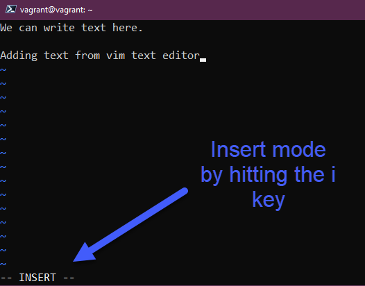
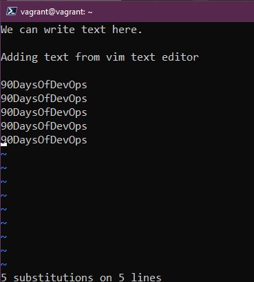

## Éditeurs de texte - nano vs vim

La majorité de vos systèmes Linux seront des serveurs et ceux-ci n'auront pas d'interface graphique (GUI). J'ai également mentionné dans la dernière session que Linux est principalement composé de fichiers de configuration. Pour apporter des modifications, vous devrez être capable d'éditer ces fichiers de configuration pour changer quoi que ce soit sur le système.

Il existe de nombreuses options, mais je pense que nous devrions couvrir probablement les deux éditeurs de texte en terminal les plus courants. J'ai utilisé ces deux éditeurs et, pour moi, `nano` est le choix facile pour des modifications rapides, mais `vim` offre un ensemble très large de capacités.

### nano

- Non disponible sur tous les systèmes.
- Idéal pour débuter.

Si vous exécutez `nano 90DaysOfDevOps.txt`, nous créerons un nouveau fichier vide. À partir de là, nous pouvons ajouter notre texte et nous avons nos instructions ci-dessous pour ce que nous voulons faire avec ce fichier.

Nous pouvons maintenant utiliser `control x + enter` et ensuite exécuter `ls`, vous pouvez maintenant voir notre nouveau fichier texte.

Nous pouvons maintenant exécuter `cat` sur ce fichier pour lire notre fichier. Nous pouvons ensuite utiliser ce même `nano 90DaysOfDevOps.txt` pour ajouter du texte supplémentaire ou modifier votre fichier.

Pour moi, nano est super facile lorsqu'il s'agit de faire de petites modifications sur des fichiers de configuration.

### vim

Probablement l'éditeur de texte le plus courant ? Un dérivé de l'éditeur de texte UNIX vi de 1976, vim offre beaucoup de fonctionnalités.

- Pratiquement supporté sur chaque distribution Linux.
- Incroyablement puissant ! Vous pouvez probablement trouver un cours complet de 7 heures couvrant uniquement vim.

Nous pouvons lancer vim avec la commande `vim` ou, si nous voulons éditer notre nouveau fichier txt, nous pourrions exécuter `vim 90DaysOfDevOps.txt`, mais vous verrez d'abord l'absence de menus d'aide en bas.

La première question pourrait être "Comment quitter vim ?". Pour cela, il faut appuyer sur `échap` et, si nous n'avons fait aucune modification, il faudra taper `:q`.

Vous commencez en mode `normal`. Il existe d'autres modes : `command`, `normal`, `visual`, `insert`. Si nous voulons ajouter du texte, nous devons passer du mode `normal` au mode `insert` en appuyant sur `i`. Si vous avez ajouté du texte et que vous souhaitez sauvegarder ces modifications, vous devez appuyer sur `échap` puis taper `:wq`.

Vous pouvez confirmer cela avec la commande `cat` pour vérifier que vous avez sauvegardé ces modifications.

Il existe des fonctionnalités rapides intéressantes avec vim qui permettent d'effectuer des tâches subalternes très rapidement si vous connaissez les raccourcis, ce qui est un sujet en soi. Supposons que nous avons ajouté une liste de mots répétés et que nous devons maintenant les changer. Peut-être s'agit-il d'un fichier de configuration et nous répétons un nom de réseau, et maintenant cela a changé et nous voulons changer cela rapidement. J'utilise le mot "day" pour cet exemple.

Maintenant, nous voulons remplacer ce mot par 90DaysOfDevOps. Nous pouvons le faire en appuyant sur `ÉCHAP` et en tapant `:%s/Day/90DaysOfDevOps`.

Le résultat, lorsque vous appuyez sur Entrée, est que le mot "day" est remplacé par 90DaysOfDevOps.

Copier et coller a été une grande révélation pour moi. Copier n'est pas copié, c'est arraché. Nous pouvons copier en utilisant `yy` sur notre clavier en mode normal. `p` colle sur la même ligne, `P` colle sur une nouvelle ligne.

Vous pouvez également supprimer ces lignes en choisissant le nombre de lignes que vous souhaitez supprimer suivi de `dd`.

Il y aura probablement aussi un moment où vous aurez besoin de rechercher dans un fichier. Maintenant, nous pouvons utiliser `grep` comme mentionné dans une session précédente, mais nous pouvons aussi utiliser vim. Nous pouvons utiliser `/word` et cela trouvera la première correspondance. Pour naviguer vers la suivante, vous utiliserez la touche `n` et ainsi de suite.

Pour vim, cela ne fait même pas effleurer la surface. Le meilleur conseil que je puisse donner est de pratiquer et d'utiliser vim autant que possible.

Une question d'entretien courante est "Quel est votre éditeur de texte préféré sous Linux ?" et je m'assurerais que vous ayez au moins cette connaissance des deux pour pouvoir répondre. Il est tout à fait acceptable de dire nano parce que c'est simple. Au moins, vous montrez que vous savez ce qu'est un éditeur de texte. Mais pratiquez avec eux pour être plus compétent.

Un autre conseil pour naviguer dans vim : nous pouvons utiliser `H, J, K, L` ainsi que nos touches fléchées.

## Ressources

- [Vim en 100 secondes](https://www.youtube.com/watch?v=-txKSRn0qeA)
- [Tutoriel Vim](https://www.youtube.com/watch?v=IiwGbcd8S7I)
- [Apprenez les fondamentaux de Linux - Partie 1](https://www.youtube.com/watch?v=kPylihJRG70)
- [Linux pour les hackers (ne vous inquiétez pas, vous n'avez pas besoin d'être un hacker !)](https://www.youtube.com/watch?v=VbEx7B_PTOE)

À demain pour le [Jour 18](day18.md)