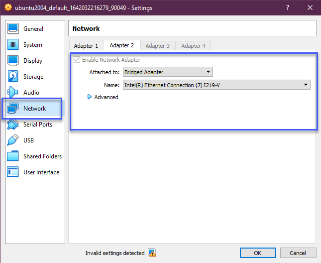
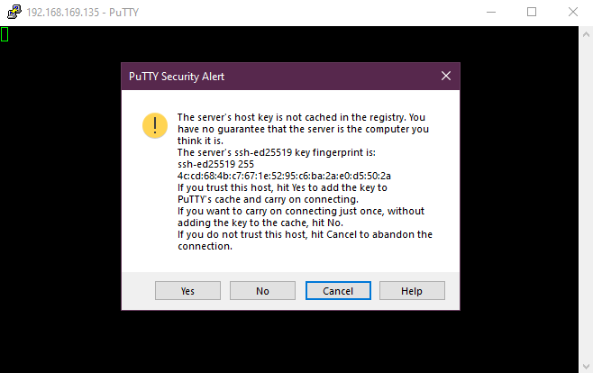
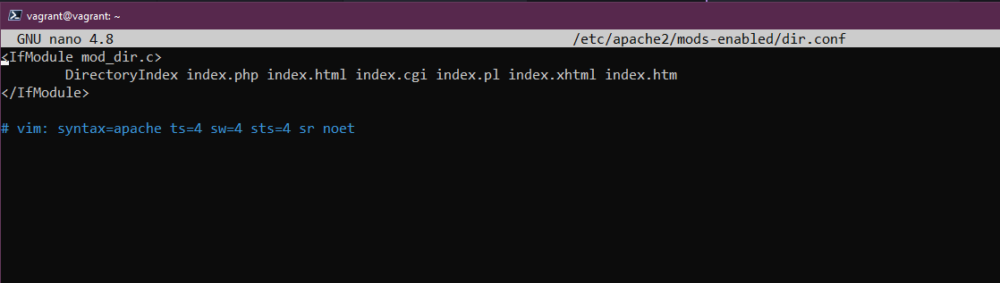

## SSH et Serveur Web

Comme nous l'avons mentionné tout au long de ce guide, vous allez probablement gérer de nombreux serveurs Linux distants. En raison de cela, vous devez vous assurer que votre connectivité à ces serveurs distants est sécurisée. Dans cette section, nous allons couvrir certains des fondamentaux de SSH que tout le monde devrait connaître pour vous aider à créer ce tunnel sécurisé vers vos systèmes distants.

- Établir une connexion avec SSH
- Transférer des fichiers
- Créer votre clé privée

### Introduction à SSH

- Secure Shell
- Protocole de réseau
- Permet des communications sécurisées
- Peut sécuriser n'importe quel service réseau
- Généralement utilisé pour l'accès à distance en ligne de commande

Dans notre environnement, si vous avez suivi, nous avons déjà utilisé SSH, mais tout cela a été configuré et automatisé via notre configuration Vagrant. Nous n'avions donc qu'à exécuter `vagrant ssh` pour accéder à notre machine virtuelle distante.

Si notre machine distante n'était pas sur le même système que notre poste de travail et se trouvait dans un emplacement distant, peut-être un système basé sur le cloud ou fonctionnant dans un centre de données auquel nous ne pouvions accéder que via Internet, nous aurions besoin d'un moyen sécurisé d'accéder au système pour le gérer.

SSH fournit un tunnel sécurisé entre le client et le serveur afin que rien ne puisse être intercepté par des acteurs malveillants.


Le serveur dispose d'un service SSH côté serveur toujours en cours d'exécution et à l'écoute sur un port TCP spécifique (22).

Si nous utilisons notre client pour nous connecter avec les identifiants corrects ou la clé SSH, nous obtenons alors l'accès à ce serveur.

### Ajout d'un adaptateur réseau ponté à notre système

Pour utiliser cela avec notre VM Virtual Box actuelle, nous devons ajouter un adaptateur réseau ponté à notre machine.

Éteignez votre machine virtuelle, faites un clic droit sur votre machine dans Virtual Box et sélectionnez les paramètres. Dans la nouvelle fenêtre, sélectionnez ensuite Réseau.



Maintenant, rallumez votre machine et vous aurez une adresse IP sur votre machine locale. Vous pouvez confirmer cela avec la commande `IP addr`.

### Confirmation que le serveur SSH est en cours d'exécution

Nous savons que SSH est déjà configuré sur notre machine puisque nous l'avons utilisé avec Vagrant, mais nous pouvons le confirmer en exécutant :

`sudo systemctl status ssh`


Si votre système n'a pas le serveur SSH, vous pouvez l'installer en exécutant cette commande `sudo apt install OpenSSH-server`.

Ensuite, vous devez vous assurer que notre SSH est autorisé si le pare-feu est en cours d'exécution. Nous pouvons le faire avec `sudo ufw allow ssh`. Cela n'est pas nécessaire sur notre configuration car nous l'avons automatisé avec notre provisionnement Vagrant.

### Accès à distance - Mot de passe SSH

Maintenant que notre serveur SSH écoute sur le port 22 pour toute demande de connexion entrante et que nous avons ajouté le réseau ponté, nous pourrions utiliser Putty ou un client SSH sur notre machine locale pour nous connecter à notre système en utilisant SSH.

[# Guide d'installation de PuTTy](https://www.cuit.columbia.edu/putty).


Ensuite, cliquez sur Ouvrir. Si c'est la première fois que vous vous connectez à ce système via cette adresse IP, vous recevrez cet avertissement. Nous savons que c'est notre système, vous pouvez donc choisir oui.



Nous sommes ensuite invités à entrer notre nom d'utilisateur (vagrant) et notre mot de passe (mot de passe par défaut - vagrant). Ci-dessous, vous verrez que nous utilisons maintenant notre client SSH (Putty) pour nous connecter à notre machine en utilisant le nom d'utilisateur et le mot de passe.


À ce stade, nous sommes connectés à notre VM depuis notre client distant et nous pouvons émettre nos commandes sur notre système.

### Accès à distance - Clé SSH

La méthode ci-dessus est un moyen facile d'accéder à vos systèmes, mais elle repose toujours sur un nom d'utilisateur et un mot de passe. Si un acteur malveillant obtenait ces informations ainsi que l'adresse publique ou l'adresse IP de votre système, celui-ci pourrait être facilement compromis. C'est là que les clés SSH sont préférées.

Les clés SSH signifient que nous fournissons une paire de clés afin que le client et le serveur sachent qu'il s'agit d'un appareil de confiance.

Créer une clé est facile. Sur notre machine locale (Windows), nous pouvons exécuter la commande suivante. En fait, si vous avez un client SSH installé sur n'importe quel système, je pense que cette même commande fonctionnera ?

`ssh-keygen -t ed25519`

Je ne vais pas entrer dans les détails de ce qu'est et signifie `ed25519`, mais vous pouvez faire une recherche si vous souhaitez en savoir plus sur la [cryptographie](https://en.wikipedia.org/wiki/EdDSA#Ed25519).


À ce stade, nous avons notre clé SSH créée stockée dans `C:\Users\micha\.ssh\`.

Mais pour lier cela à notre VM Linux, nous devons copier la clé. Nous pouvons le faire en utilisant `ssh-copy-id vagrant@192.168.169.135`.

J'ai utilisé PowerShell pour créer mes clés sur mon client Windows, mais il n'y a pas de `ssh-copy-id` disponible ici. Il existe des moyens de le faire sous Windows et une petite recherche en ligne vous trouvera une alternative, mais je vais simplement utiliser git bash sur ma machine Windows pour faire la copie.


Nous pouvons maintenant revenir à PowerShell pour tester que notre connexion fonctionne maintenant avec nos clés SSH et qu'aucun mot de passe n'est requis.

`ssh vagrant@192.168.169.135`


Nous pourrions sécuriser cela davantage si nécessaire en utilisant une phrase de passe. Nous pourrions également aller plus loin en disant qu'aucun mot de passe du tout, ce qui signifie que seules les paires de clés sur SSH seraient autorisées. Vous pouvez faire cela dans le fichier de configuration suivant.

`sudo nano /etc/ssh/sshd_config`

Il y a une ligne ici avec `PasswordAuthentication yes`, celle-ci est commentée avec `#`. Vous devez décommenter et changer le "yes" en "no". Vous devrez ensuite recharger le service SSH avec `sudo systemctl reload sshd`.

## Configuration d'un serveur Web

Cela n'est pas spécifiquement lié à ce que nous venons de faire avec SSH ci-dessus, mais je voulais inclure ceci car c'est encore une autre tâche que vous pourriez trouver un peu intimidante, mais cela ne devrait vraiment pas l'être.

Nous avons notre VM de terrain de jeu Linux et à ce stade, nous voulons ajouter un serveur web Apache à notre VM afin que nous puissions héberger un site web simple à partir de celui-ci qui dessert mon réseau domestique. Notez que cette page web ne sera pas accessible depuis Internet, cela peut être fait mais ne sera pas couvert ici.

Vous verrez également cela appelé une pile LAMP.

- **L**inux Operating System
- **A**pache Web Server
- **M**ySQL database
- **P**HP

### Apache2

Apache2 est un serveur HTTP open-source. Nous pouvons installer Apache2 avec la commande suivante.

`sudo apt-get install apache2`

Pour confirmer qu'Apache2 est installé correctement, nous pouvons exécuter `sudo service apache2 restart`.

Ensuite, en utilisant l'adresse réseau pontée du didacticiel SSH, ouvrez un navigateur et accédez à cette adresse. La mienne était `http://192.168.169.135/`.


### MySQL

MySQL est une base de données dans laquelle nous allons stocker nos données pour notre site web simple. Pour installer MySQL, nous devons utiliser la commande suivante `sudo apt-get install mysql-server`.

### PHP

PHP est un langage de script côté serveur, nous allons l'utiliser pour interagir avec une base de données MySQL. La dernière installation consiste à obtenir PHP et les dépendances installées en utilisant `sudo apt-get install php libapache2-mod-php php-mysql`.

Le premier changement de configuration que nous voulons faire est qu'Apache utilise index.html et nous voulons qu'il utilise index.php à la place.

Nous allons utiliser `sudo nano /etc/apache2/mods-enabled/dir.conf` et nous allons déplacer index.php en premier élément de la liste.



Redémarrez le service Apache2 `sudo systemctl restart apache2`.

Maintenant, confirmons que notre système est correctement configuré pour PHP. Créez le fichier suivant en utilisant cette commande, cela ouvrira un fichier vide dans nano.

`sudo nano /var/www/html/90Days.php`

Ensuite, copiez ce qui suit et utilisez control + x pour quitter et enregistrer votre fichier.

```php
<?php
phpinfo();
?>
```

Maintenant, naviguez à nouveau vers l'adresse IP de votre VM Linux avec 90Days.php à la fin de l'URL. `http://192.168.169.135/90Days.php`. Vous devriez voir quelque chose de similaire ci-dessous si PHP est correctement configuré.


### Installation de WordPress

Ensuite, j'ai suivi ce tutoriel pour installer WordPress sur notre pile LAMP. Certaines commandes sont indiquées ci-dessous si elles ne sont pas correctement affichées dans le tutoriel [Comment installer WordPress sur Ubuntu avec LAMP](https://blog.ssdnodes.com/blog/how-to-install-wordpress-on-ubuntu-18-04-with-lamp-tutorial/).

```bash
sudo mysql -u root -p
CREATE DATABASE wordpressdb;
CREATE USER 'admin-user'@'localhost' IDENTIFIED BY 'password';
GRANT ALL PRIVILEGES ON wordpressdb.* TO 'admin-user'@'localhost';
FLUSH PRIVILEGES;
EXIT;

sudo apt install php-curl php-gd php-mbstring php-xml php-xmlrpc php-soap php-intl php-zip
sudo systemctl restart apache2
cd /var/www
sudo curl -O https://wordpress.org/latest.tar.gz
sudo tar -xvf latest.tar.gz
sudo rm latest.tar.gz
```
À ce stade, vous êtes à l'étape 4 de l'article lié. Vous devrez suivre les étapes pour vous assurer que toutes les autorisations correctes sont en place pour le répertoire WordPress.

Comme il s'agit d'un accès interne uniquement, vous n'avez pas besoin de "générer des clés de sécurité" à cette étape. Passez à l'étape 5 qui consiste à changer la configuration Apache pour WordPress.

Ensuite, si tout est correctement configuré, vous pourrez accéder via votre adresse réseau interne et suivre l'installation de WordPress.

## Ressources

- [Client SSH GUI - Remmina](https://remmina.org/)
- [Le guide du débutant pour SSH](https://www.youtube.com/watch?v=2QXkrLVsRmk)
- [Vim en 100 secondes](https://www.youtube.com/watch?v=-txKSRn0qeA)
- [Tutoriel Vim](https://www.youtube.com/watch?v=IiwGbcd8S7I)
- [Apprenez les fondamentaux de Linux - Partie 1](https://www.youtube.com/watch?v=kPylihJRG70)
- [Linux pour les hackers (ne vous inquiétez pas, vous n'avez pas besoin d'être un hacker !)](https://www.youtube.com/watch?v=VbEx7B_PTOE)

À demain pour le [Jour 19](day19.md)