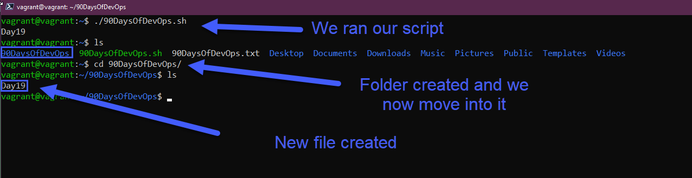

## Automatiser les tâches avec des scripts bash

Le shell que nous allons utiliser aujourd'hui est bash, mais nous aborderons un autre shell demain lorsque nous plongerons dans ZSH.

BASH - **B**ourne **A**gain **Sh**ell

Nous pourrions presque consacrer une section entière de 7 jours au script shell, tout comme les langages de programmation. Bash nous donne la capacité de travailler aux côtés d'autres outils d'automatisation pour accomplir des tâches.

Je parle encore à beaucoup de personnes qui ont configuré des scripts shell complexes pour faire quelque chose et qui dépendent de ce script pour certaines des choses les plus importantes de l'entreprise. Je ne dis pas que nous devons comprendre le script shell/bash à cette fin, ce n'est pas la bonne manière. Mais nous devrions apprendre le script shell/bash pour travailler aux côtés de nos outils d'automatisation et pour des tâches ponctuelles.

Un exemple de cela que nous avons utilisé dans cette section pourrait être le fichier VAGRANTFILE que nous avons utilisé pour créer notre VM. Nous pourrions intégrer cela dans un simple script bash qui supprime et renouvelle cela chaque lundi matin afin que nous ayons une copie fraîche de notre VM Linux chaque semaine. Nous pourrions également ajouter toute la pile logicielle dont nous avons besoin sur ladite machine Linux, et ainsi de suite, tout au long de ce script bash.

Je pense qu'une autre chose que j'entends de plus en plus, c'est que les questions de script pratique deviennent de plus en plus apparentes dans toutes les lignes d'entretien.

### Pour commencer

Comme pour beaucoup de choses que nous couvrons dans ces 90 jours, la seule véritable façon d'apprendre est de faire. L'expérience pratique va aider à intégrer tout cela dans votre mémoire musculaire.

Tout d'abord, nous allons avoir besoin d'un éditeur de texte. Le [Jour 17](day17.md), nous avons couvert probablement les deux éditeurs de texte les plus courants et un peu comment les utiliser.

Plongeons directement et créons notre premier script shell.

`touch 90DaysOfDevOps.sh`

Suivi de `nano 90DaysOfDevOps.sh`, cela ouvrira notre nouveau script shell vierge dans nano. Vous pouvez également choisir votre éditeur de texte préféré ici.

La première ligne de tous les scripts bash doit ressembler à ceci `#!/usr/bin/bash`, c'est le chemin vers votre binaire bash.

Vous devez cependant vérifier cela dans le terminal en exécutant `which bash`. Si vous n'utilisez pas Ubuntu, vous pouvez également essayer `whereis bash` depuis le terminal.

Cependant, vous pouvez voir d'autres chemins listés dans les scripts shell déjà créés, qui pourraient inclure :

- `#!/bin/bash`
- `#!/usr/bin/env bash`

Dans la ligne suivante de notre script, j'aime ajouter un commentaire et ajouter le but du script ou au moins quelques informations sur moi. Vous pouvez le faire en utilisant le `#`. Cela nous permet de commenter certaines lignes de notre code et de fournir des descriptions de ce que les commandes à venir vont faire. Je trouve que plus il y a de notes, mieux c'est pour l'expérience utilisateur, surtout si vous partagez cela.

Je utilise parfois figlet, un programme que nous avons installé précédemment dans la section Linux pour créer de l'art ascii pour démarrer nos scripts.


Toutes les commandes que nous avons parcourues précédemment dans cette section Linux ([Jour 15](day15.md)) pourraient être utilisées ici comme une simple commande pour tester notre script.

Ajoutons un simple bloc de code à notre script.

```
mkdir 90DaysOfDevOps
cd 90DaysOfDevOps
touch Day19
ls
```

Vous pouvez ensuite enregistrer cela et quitter votre éditeur de texte. Si nous exécutons notre script avec `./90DaysOfDevOps.sh`, vous devriez obtenir un message d'autorisation refusée. Vous pouvez vérifier les autorisations de ce fichier en utilisant la commande `ls -al` et vous pouvez voir en surbrillance que nous n'avons pas les droits d'exécution sur ce fichier.


Nous pouvons changer cela en utilisant `chmod +x 90DaysOfDevOps.sh` et vous verrez alors le `x` signifiant que nous pouvons maintenant exécuter notre script.


Maintenant, nous pouvons réexécuter notre script en utilisant `./90DaysOfDevOps.sh`. Après avoir exécuté le script, un nouveau répertoire a été créé, nous sommes passés dans ce répertoire, puis un nouveau fichier a été créé.



C'est assez basique, mais vous pouvez commencer à voir, espérons-le, comment cela pourrait être utilisé pour appeler d'autres outils dans le cadre de moyens pour vous faciliter la vie et automatiser les choses.

### Variables, Conditionnelles

Une grande partie de cette section est une répétition de ce que nous avons couvert lorsque nous apprenions Golang, mais je pense qu'il vaut la peine de replonger ici.

- ### Variables

Les variables nous permettent de définir une fois un terme répété particulier qui est utilisé dans tout un script potentiellement complexe.

Pour ajouter une variable, vous l'ajoutez simplement comme ceci à une ligne propre de votre script.

`challenge="90DaysOfDevOps"`

De cette manière, lorsque et où nous utilisons `$challenge` dans notre code, si nous changeons la variable, cela sera reflété partout.


Si nous exécutons maintenant notre script `sh`, vous verrez l'impression qui a été ajoutée à notre script.


Nous pouvons également demander une entrée utilisateur qui peut définir nos variables en utilisant ce qui suit :

```
echo "Enter your name"
read name
```

Cela définirait alors l'entrée comme la variable `$name`. Nous pourrions ensuite l'utiliser plus tard.

- ### Conditionnelles

Peut-être voulons-nous savoir qui nous avons sur notre défi et combien de jours ils ont complétés. Nous pouvons définir cela en utilisant les conditionnelles `if` `if-else` `else-if`, c'est ce que nous avons défini ci-dessous dans notre script.

```
#!/bin/bash
#  ___   ___  ____                   ___   __ ____              ___
# / _ \ / _ \|  _ \  __ _ _   _ ___ / _ \ / _|  _ \  _____   __/ _ \ _ __  ___
#| (_) | | | | | | |/ _` | | | / __| | | | |_| | | |/ _ \ \ / / | | | '_ \/ __|
# \__, | |_| | |_| | (_| | |_| \__ \ |_| |  _| |_| |  __/\ V /| |_| | |_) \__ \
#   /_/ \___/|____/ \__,_|\__, |___/\___/|_| |____/ \___| \_/  \___/| .__/|___/
#                         |___/                                     |_|
#
# This script is to demonstrate bash scripting!

# Variables to be defined

ChallengeName=#90DaysOfDevOps
TotalDays=90

# User Input

echo "Enter Your Name"
read name
echo "Welcome $name to $ChallengeName"
echo "How Many Days of the $ChallengeName challenge have you completed?"
read DaysCompleted

if [ $DaysCompleted -eq 90 ]
then
  echo "You have finished, well done"
elif [ $DaysCompleted -lt 90 ]
then
  echo "Keep going you are doing great"
else
  echo "You have entered the wrong amount of days"
fi
```

Vous pouvez également voir ci-dessus que nous effectuons certaines comparaisons ou vérifications de valeurs les unes par rapport aux autres pour passer à l'étape suivante. Nous avons différentes options ici qui valent la peine d'être notées.

- `eq` - si les deux valeurs sont égales, retourne VRAI
- `ne` - si les deux valeurs ne sont pas égales, retourne VRAI
- `gt` - si la première valeur est supérieure à la deuxième valeur, retourne VRAI
- `ge` - si la première valeur est supérieure ou égale à la deuxième valeur, retourne VRAI
- `lt` - si la première valeur est inférieure à la deuxième valeur, retourne VRAI
- `le` - si la première valeur est inférieure ou égale à la deuxième valeur, retourne VRAI

Nous pourrions également utiliser le script bash pour déterminer des informations sur les fichiers et les dossiers, c'est ce qu'on appelle les conditions de fichier.

- `-d file` Vrai si le fichier est un répertoire
- `-e file` Vrai si le fichier existe
- `-f file` Vrai si la chaîne fournie est un fichier
- `-g file` Vrai si l'identifiant de groupe est défini sur un fichier
- `-r file` Vrai si le fichier est lisible
- `-s file` Vrai si le fichier a une taille non nulle

```
FILE="90DaysOfDevOps.txt"
if [ -f "$FILE" ]
then
  echo "$FILE is a file"
else
  echo "$FILE is not a file"
fi
```


À condition que nous ayons ce fichier toujours dans notre répertoire, nous devrions obtenir la première commande echo en retour. Mais si nous supprimons ce fichier, nous devrions obtenir la deuxième commande echo.


Vous pouvez espérons voir comment cela peut être utilisé pour vous faire gagner du temps lors de la recherche dans un système d'éléments spécifiques.

J'ai trouvé ce dépôt incroyable sur GitHub qui semble contenir une quantité infinie de scripts [DevOps Bash Tools](https://github.com/HariSekhon/DevOps-Bash-tools/blob/master/README.md).

### Exemple

**Scénario** : Nous avons notre entreprise appelée "90DaysOfDevOps" et nous fonctionnons depuis un certain temps et maintenant il est temps d'élargir l'équipe d'une personne à beaucoup plus au cours des prochaines semaines. Je suis le seul à connaître le processus d'intégration jusqu'à présent, nous voulons donc réduire ce goulot d'étranglement en automatisant certaines de ces tâches.

**Exigences** :

- Un utilisateur peut être passé en tant qu'argument de ligne de commande.
- Un utilisateur est créé avec le nom de l'argument de ligne de commande.
- Un mot de passe peut être analysé en tant qu'argument de ligne de commande.
- Le mot de passe est défini pour l'utilisateur.
- Un message de création de compte réussie est affiché.

Commençons par créer notre script shell avec `touch create_user.sh`.

Avant de continuer, rendons également cela exécutable en utilisant `chmod +x create_user.sh`.

Ensuite, nous pouvons utiliser `nano create_user.sh` pour commencer à éditer notre script pour le scénario que nous avons défini.

Nous pouvons examiner la première exigence "Un utilisateur peut être passé en tant qu'argument de ligne de commande", nous pouvons utiliser ce qui suit :

```
#! /usr/bin/bash

#Un utilisateur peut être passé en tant qu'argument de ligne de commande
echo "$1"
```


Allez-y et exécutez ceci en utilisant `./create_user.sh Michael`, remplacez Michael par votre nom lorsque vous exécutez le script.


Ensuite, nous pouvons prendre cette deuxième exigence "Un utilisateur est créé avec le nom de l'argument de ligne de commande", cela peut être fait avec la commande `useradd`. L'option `-m` est de créer le répertoire personnel de l'utilisateur en tant que /home/nomutilisateur.

```
#! /usr/bin/bash

#Un utilisateur peut être passé en tant qu'argument de ligne de commande
echo "$1 user account being created."

#Un utilisateur est créé avec le nom de l'argument de ligne de commande
sudo useradd -m "$1"
```

Avertissement : Si vous ne fournissez pas de nom de compte utilisateur, cela générera une erreur car nous n'avons pas rempli la variable `$1`.

Nous pouvons ensuite vérifier que ce compte a été créé avec la commande `awk -F: '{ print $1}' /etc/passwd`.


Notre prochaine exigence est "Un mot de passe peut être analysé en tant qu'argument de ligne de commande." Tout d'abord, nous n'allons jamais faire cela en production, c'est plus pour nous permettre de parcourir une liste d'exigences dans le laboratoire pour comprendre.

```
#! /usr/bin/bash

#Un utilisateur peut être passé en tant qu'argument de ligne de commande
echo "$1 user account being created."

#Un utilisateur est créé avec le nom de l'argument de ligne de commande
sudo useradd -m "$1"

#Un mot de passe peut être analysé en tant qu'argument de ligne de commande.
sudo chpasswd <<< "$1":"$2"
```

Si nous exécutons ensuite ce script avec les deux paramètres `./create_user.sh 90DaysOfDevOps password`, vous pouvez voir à partir de l'image ci-dessous que nous avons exécuté notre script, il a créé notre utilisateur et notre mot de passe, puis nous avons manuellement basculé dans cet utilisateur et confirmé avec la commande `whoami`.


La dernière exigence est "Un message de création de compte réussie est affiché." Nous avons déjà cela dans la première ligne de notre code et nous pouvons voir sur la capture d'écran ci-dessus que nous avons un `90DaysOfDevOps user account being created` affiché. Cela a été laissé de nos tests avec le paramètre `$1`.

Maintenant, ce script peut être utilisé pour intégrer et configurer rapidement de nouveaux utilisateurs sur nos systèmes Linux. Mais peut-être qu'au lieu que quelques-unes des personnes historiques doivent travailler à travers cela et ensuite obtenir d'autres personnes leurs nouveaux noms d'utilisateur ou mots de passe, nous pourrions ajouter une certaine entrée utilisateur que nous avons couverte précédemment pour capturer nos variables.

```
#! /usr/bin/bash

echo "What is your intended username?"
read  username
echo "What is your password"
read  password

#Un utilisateur peut être passé en tant qu'argument de ligne de commande
echo "$username user account being created."

#Un utilisateur est créé avec le nom de l'argument de ligne de commande
sudo useradd -m $username

#Un mot de passe peut être analysé en tant qu'argument de ligne de commande.
sudo chpasswd <<< $username:$password
```

Avec les étapes étant plus interactives,


Pour terminer, peut-être voulons-nous sortir une sortie réussie pour dire que notre nouveau compte utilisateur a fini d'être créé.


Une chose que j'ai remarquée, c'est que nous affichons le mot de passe dans notre entrée, nous pouvons masquer cela en utilisant le drapeau `-s` dans la ligne de code `read -s password`.


Si vous souhaitez supprimer l'utilisateur que vous avez créé à des fins de laboratoire, vous pouvez le faire avec `sudo userdel test_user`.

[Script d'exemple](Linux/create-user.sh)

Encore une fois, je ne dis pas que c'est quelque chose que vous allez créer dans votre quotidien, mais c'était quelque chose auquel j'ai pensé qui pourrait souligner la flexibilité de ce que vous pourriez utiliser le script shell.

Pensez à toutes les tâches répétitives que vous faites chaque jour, chaque semaine ou chaque mois et comment vous pourriez mieux les automatiser. La première option sera probablement d'utiliser un script bash avant de passer à un territoire plus complexe.

J'ai créé un fichier bash très simple qui m'aide à lancer un cluster Kubernetes en utilisant minikube sur ma machine locale ainsi que des services de données et Kasten K10 pour aider à démontrer les besoins et les exigences en matière de gestion des données. [Project Pace](https://github.com/MichaelCade/project_pace/blob/main/singlecluster_demo.sh) Mais je ne pensais pas que cela était approprié à soulever ici car nous n'avons pas encore couvert Kubernetes.

## Ressources

- [Bash en 100 secondes](https://www.youtube.com/watch?v=I4EWvMFj37g)
- [Script bash avec des exemples pratiques - Cours complet](https://www.youtube.com/watch?v=TPRSJbtfK4M)
- [Client SSH GUI - Remmina](https://remmina.org/)
- [Le guide du débutant pour SSH](https://www.youtube.com/watch?v=2QXkrLVsRmk)
- [Vim en 100 secondes](https://www.youtube.com/watch?v=-txKSRn0qeA)
- [Tutoriel Vim](https://www.youtube.com/watch?v=IiwGbcd8S7I)
- [Apprenez les fondamentaux de Linux - Partie 1](https://www.youtube.com/watch?v=kPylihJRG70)
- [Linux pour les hackers (ne vous inquiétez pas, vous n'avez pas besoin d'être un hacker !)](https://www.youtube.com/watch?v=VbEx7B_PTOE)

À demain pour le [Jour 20](day20.md)